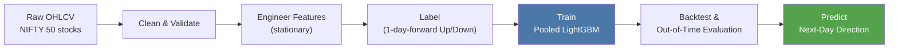
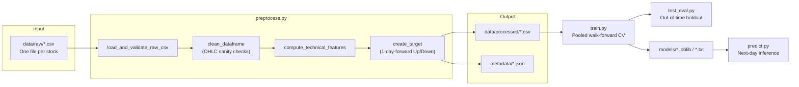
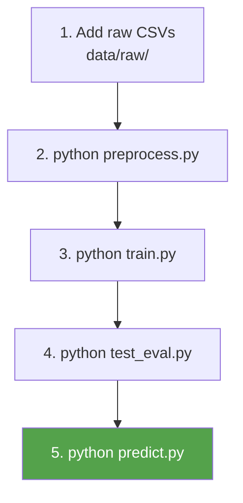

# NIFTY 50 Directional Forecasting — Baseline Model

> **Status:** Baseline quantitative trading project.
>
> This module handles data ingestion, feature engineering, labeling, model training, evaluation, and inference for a **generalized, pooled-stock next-day direction classifier**.
>
> Later project phases—such as portfolio construction, risk management, live execution, and alternative model families—can build on the artifacts produced by this pipeline.

---

## 1. What This Baseline Does

Given raw daily OHLCV data for NIFTY 50 constituents, this pipeline:

1. Cleans and validates each stock's price history.
2. Engineers stationary, scale-free technical and market-microstructure features.
3. Labels each row with a one-day-forward **Up/Down** binary target.
4. Trains **one generalized LightGBM classifier** pooled across all stocks using walk-forward (`TimeSeriesSplit`) cross-validation.
5. Backtests the resulting signal with execution lag and transaction costs.
6. Evaluates the final model on a strictly out-of-time holdout.
7. Serves next-day predictions for a single symbol or the full universe.

The design is intentionally simple: a single pooled gradient-boosted tree model trained on hand-engineered features. It serves as a **performance and correctness baseline** against which future approaches—such as deep learning, per-stock models, ensemble stacking, and alternative targets—can be compared.



---

## 2. Project Structure

```text
project_root/
├── config.py                   # Paths, constants, and column rules
├── feature_engineering.py      # Stateless feature computation
├── preprocess.py               # Ingestion, cleaning, features, labeling
├── train.py                    # Pooled LightGBM training, CV, backtesting
├── test_eval.py                # Independent out-of-time evaluation
├── predict.py                  # Single-symbol and batch inference
│
├── data/
│   ├── raw/                    # Input CSV files
│   └── processed/              # Cleaned, featurized, labeled datasets
│
├── metadata/                   # Per-symbol preprocessing audit logs
├── models/                     # Serialized model artifacts
└── reports/                    # Batch prediction reports
```

All required directories are created automatically by `config.py` when needed.

`config.py` is the central configuration layer. Every other module imports its paths, constants, and rules rather than duplicating paths or magic numbers.

---

## 3. Pipeline Architecture
<div align="center">

Raw CSVs  
↓  
Ingest & Clean  
↓  
Feature Engineering  
↓  
Target Labeling  
↓  
Train  
↓  
Evaluate  
↓  
Predict

</div>



The pipeline is designed to preserve chronological order. Feature windows, target construction, cross-validation, and backtesting should use only information available at the relevant point in time.

---

# 4. Module Documentation

## 4.1 `config.py` — Single Source of Truth

`config.py` centralizes the configuration used throughout the pipeline.

| Constant                                                                          | Purpose                                                                    |
| --------------------------------------------------------------------------------- | -------------------------------------------------------------------------- |
| `RAW_DATA_DIR`, `PROCESSED_DATA_DIR`, `METADATA_DIR`, `MODELS_DIR`, `REPORTS_DIR` | Canonical directory layout                                                 |
| `IGNORED_FILES`                                                                   | Non-per-stock files excluded from ingestion                                |
| `EXCLUDE_COLUMNS`                                                                 | Identifier, raw-price, leakage, and output columns excluded from the model |
| `GENERALIZED_MODEL_NAME`                                                          | Filename for the pooled model artifact                                     |
| `DATE_COLUMN`, `TARGET_COLUMN`                                                    | `"Date"` and `"Target"`                                                    |
| `TARGET_SHIFT`                                                                    | Forecast horizon, currently `1` trading day                                |
| `TRANSACTION_COST_BPS`                                                            | Transaction-cost assumption used in backtesting                            |

Centralizing these values ensures that changes to the forecast horizon, transaction costs, or feature exclusions propagate consistently throughout the project.

---

## 4.2 `feature_engineering.py` — Stationary Feature Engine

The module exposes a stateless feature-engineering function:

```python
compute_technical_features(
    df: pd.DataFrame,
    date_col: str = "Date"
) -> pd.DataFrame
```

The function receives a cleaned OHLCV DataFrame for **one stock**, sorts it chronologically, and appends engineered features.

Rolling and exponentially weighted calculations must remain backward-looking. Features for row `t` should never depend on data from `t + 1` or later.

### Why Normalize Features?

Raw price levels are non-stationary and vary substantially across stocks. A ₹50 stock and a ₹3,000 stock should not be treated as comparable simply because their absolute prices differ.

The feature set therefore emphasizes:

* Returns
* Ratios
* Percentage distances
* Normalized ranges
* Bounded oscillators

This makes features more comparable across the pooled stock universe.

### Feature Families

#### 1. Returns and Volatility

| Feature      | Formula                                           | Purpose                       |
| ------------ | ------------------------------------------------- | ----------------------------- |
| `Log_Return` | `ln(Close_t / Close_t-1)`                         | Daily normalized price change |
| `Vol_10D`    | Rolling 10-day standard deviation of `Log_Return` | Short-term volatility         |
| `Vol_20D`    | Rolling 20-day standard deviation of `Log_Return` | Longer volatility regime      |

#### 2. Normalized Trend Indicators

| Feature       | Formula                   | Purpose                     |
| ------------- | ------------------------- | --------------------------- |
| `Dist_SMA_10` | `(Close - SMA10) / SMA10` | Short-term trend deviation  |
| `Dist_SMA_20` | `(Close - SMA20) / SMA20` | Medium-term trend deviation |
| `Dist_SMA_50` | `(Close - SMA50) / SMA50` | Longer-term trend context   |

#### 3. Momentum

| Feature       | Formula                   | Purpose                            |
| ------------- | ------------------------- | ---------------------------------- |
| `RSI_14`      | RSI over 14 periods       | Overbought/oversold momentum       |
| `MACD`        | `(EMA12 - EMA26) / Close` | Price-normalized momentum          |
| `MACD_Signal` | 9-period EMA of `MACD`    | Smoothed signal line               |
| `MACD_Diff`   | `MACD - MACD_Signal`      | Momentum acceleration/deceleration |

#### 4. Volatility and Range

| Feature    | Formula                         | Purpose                           |
| ---------- | ------------------------------- | --------------------------------- |
| `BB_Pband` | Position within Bollinger Bands | Relative position within the band |
| `ATR_14`   | Average True Range / `Close`    | Normalized trading range          |

#### 5. Volume and Market Microstructure

| Feature            | Formula                          | Purpose                          |
| ------------------ | -------------------------------- | -------------------------------- |
| `Volume_Ratio_20`  | `Volume / 20-day average Volume` | Abnormal trading activity        |
| `VWAP_Dist`*       | `(Close - VWAP) / VWAP`          | Distance from VWAP               |
| `Deliverable_Pct`* | Normalized `%Deliverble`         | Deliverable-volume participation |

* Optional features are computed only when the required raw-data columns are available.

### Feature Count

The documented model feature set contains:

* 3 returns and volatility features
* 3 trend-distance features
* 4 momentum features
* 2 volatility/range features
* 1 mandatory volume feature
* Up to 2 optional microstructure features

Therefore, the expected feature count is **13 core features**, increasing to **15 when both optional features are available**.

The actual columns passed to the model are determined by `config.EXCLUDE_COLUMNS`.

---

## 4.3 `preprocess.py` — Ingestion, Cleaning, Labeling, and Orchestration

| Function                               | Responsibility                                                  |
| -------------------------------------- | --------------------------------------------------------------- |
| `load_and_validate_raw_csv(file_path)` | Loads and validates a raw CSV                                   |
| `clean_dataframe(df)`                  | Cleans dates and numeric columns and applies OHLC sanity checks |
| `create_target(df)`                    | Creates future-close, future-return, and binary target columns  |
| `process_single_stock(file_path)`      | Runs the complete workflow for one stock                        |
| `process_all_stocks()`                 | Processes all eligible CSV files                                |

### Required Raw Input

The minimum required schema is:

```text
Date, Open, High, Low, Close, Volume
```

Optional columns include:

```text
VWAP
%Deliverble
```

### OHLC Sanity Checks

A valid row should satisfy:

* `Open`, `High`, `Low`, and `Close` are positive.
* `Volume` is non-negative.
* `High >= Low`
* `High >= Open`
* `High >= Close`
* `Low <= Open`
* `Low <= Close`

Invalid rows are removed before feature engineering so corrupted observations do not contaminate rolling calculations.

### Target Construction

```text
Tomorrow_Close  = Close.shift(-1)

Tomorrow_Return =
    (Tomorrow_Close - Close) / Close

Target =
    1 if Tomorrow_Return > 0
    else 0
```

The final row is removed because its future outcome is unknown.

---

## 4.4 `train.py` — Pooled Walk-Forward Training

| Function                                      | Responsibility                                   |
| --------------------------------------------- | ------------------------------------------------ |
| `load_and_pool_processed_data()`              | Loads and concatenates processed stock datasets  |
| `run_strategy_backtest(df, probas, cost_bps)` | Simulates the trading strategy                   |
| `train_lightgbm_generalized(n_splits=5)`      | Runs cross-validation and trains the final model |

### Leakage Control

The model excludes:

* Date and identifier columns
* Raw OHLCV and market-data columns
* Future-derived target columns
* Strategy output columns

Examples include:

```text
Date
Symbol
Series
Prev Close
Open
High
Low
Last
Close
VWAP
Volume
Turnover
Trades
Deliverable Volume
%Deliverble
Tomorrow_Close
Tomorrow_Return
Target
Signal
Position
Trades_Count
```

Only the engineered feature columns should reach the LightGBM model.

### Training Procedure

1. Pool processed stock datasets and sort chronologically.
2. Perform 5-fold `TimeSeriesSplit` cross-validation.
3. Train a binary LightGBM classifier.
4. Apply early stopping on validation log loss.
5. Aggregate out-of-fold predictions for evaluation.
6. Optionally evaluate high-confidence predictions using the configured probability thresholds.
7. Run the strategy backtest using out-of-fold predictions.
8. Retrain the final model on the available training history and save the artifacts.

### Backtesting Assumptions

The backtest uses:

* A one-day execution offset
* Transaction costs defined in `config.TRANSACTION_COST_BPS`
* Long/cash positioning
* Position-change costs when moving between long and cash

Reported metrics may include:

* CAGR
* Sharpe ratio
* Maximum drawdown
* Win rate

---

## 4.5 `test_eval.py` — Independent Out-of-Time Evaluation

This module evaluates the trained model on a chronologically later holdout period.

The evaluation process:

1. Loads the processed datasets.
2. Sorts observations chronologically.
3. Reserves the final 15% of dates as the holdout set.
4. Scores the holdout using the trained model.
5. Reports classification and model-quality metrics.

Reported metrics include:

* Accuracy
* ROC-AUC
* Log loss
* Confusion matrix
* Classification report
* Feature importance

The same high-conviction threshold can also be applied to evaluate only the model's strongest predictions.

---

## 4.6 `predict.py` — Inference

| Function                          | Responsibility                                    |
| --------------------------------- | ------------------------------------------------- |
| `predict_stock_direction(symbol)` | Generates predictions for one symbol              |
| `predict_all_stocks()`            | Generates predictions across all processed stocks |

### CLI Usage

```bash
# Predict one stock
python predict.py ADANIPORTS

# Predict the full universe
python predict.py
```

Batch inference keeps the latest prediction for each available symbol and writes the results to:

```text
reports/latest_batch_predictions_lightgbm.csv
```

Per-symbol failures are logged so that one malformed dataset does not stop the full prediction run.

---

# 5. End-to-End Usage

```bash
# 1. Add raw per-stock CSV files to data/raw/

# 2. Clean data, engineer features, and create targets
python preprocess.py

# 3. Train the pooled LightGBM model
python train.py

# 4. Evaluate on the out-of-time holdout
python test_eval.py

# 5. Generate predictions for all stocks
python predict.py

# Or predict a single stock
python predict.py ADANIPORTS
```



---

# 6. Output Artifacts

| Location                                        | Contents                                        |
| ----------------------------------------------- | ----------------------------------------------- |
| `data/processed/<SYMBOL>.csv`                   | Cleaned, featurized, labeled dataset            |
| `metadata/<SYMBOL>.json`                        | Per-symbol preprocessing audit log              |
| `models/lightgbm_generalized_50stocks.txt`      | Raw LightGBM booster                            |
| `models/lightgbm_generalized_50stocks.joblib`   | Serialized model wrapper                        |
| `reports/latest_batch_predictions_lightgbm.csv` | Latest prediction and confidence for each stock |

---

# 7. Feature Summary

| Feature Family           | Core Count | Features                                     |
| ------------------------ | ---------: | -------------------------------------------- |
| Returns & Volatility     |          3 | `Log_Return`, `Vol_10D`, `Vol_20D`           |
| Trend Distance           |          3 | `Dist_SMA_10`, `Dist_SMA_20`, `Dist_SMA_50`  |
| Momentum                 |          4 | `RSI_14`, `MACD`, `MACD_Signal`, `MACD_Diff` |
| Volatility Bands & Range |          2 | `BB_Pband`, `ATR_14`                         |
| Volume                   |          1 | `Volume_Ratio_20`                            |
| Optional Microstructure  |        0–2 | `VWAP_Dist`, `Deliverable_Pct`               |

**Total:** 13 core features, with up to 15 when both optional microstructure features are available.

---

# 8. Design Principles

1. **No look-ahead bias**
   Feature windows, target construction, validation, and backtesting should respect chronological order.

2. **Normalized features over raw prices**
   Returns, ratios, percentage distances, and oscillators are more suitable for a pooled multi-stock model than raw price levels.

3. **Realistic backtesting assumptions**
   The strategy includes execution lag and transaction costs.

4. **Configuration-driven design**
   Shared paths, target definitions, and exclusion rules are centralized in `config.py`.

5. **Fault tolerance**
   Per-file failures during preprocessing and inference can be logged without stopping the entire batch.

---

# 9. Known Limitations and Future Extensions

This project is intended as a baseline. Current limitations include:

* **Single pooled model:** No per-stock or sector-specific models.
* **Binary direction prediction:** The model predicts direction rather than return magnitude.
* **Fixed confidence thresholds:** High-conviction filtering uses fixed probability cutoffs.
* **Long/cash strategy only:** No short selling, leverage, or portfolio-level allocation.
* **Fixed one-day forecast horizon:** Controlled by `TARGET_SHIFT`.
* **Fixed transaction-cost assumption:** Controlled by `TRANSACTION_COST_BPS`.
* **No hyperparameter search:** Current LightGBM parameters are manually selected.
* **Hand-engineered features only:** No fundamental, alternative, sentiment, or cross-sectional data.

These limitations are deliberate baseline simplifications and provide clear directions for future experimentation.

## Future Work

Possible next steps include:

* Per-stock and sector-specific models
* Hyperparameter optimization
* Probability calibration
* Alternative forecast horizons
* Regression or ranking targets
* Cross-sectional features
* Portfolio construction and position sizing
* Risk management
* Live inference and execution infrastructure

---

## Summary

This module provides a structured baseline for forecasting next-day stock direction across the NIFTY 50 universe. Its core principles are:

* Chronologically safe processing
* Leakage-aware feature selection
* Normalized cross-stock features
* Walk-forward validation
* Realistic transaction assumptions
* Independent out-of-time evaluation

The resulting artifacts provide a reproducible foundation for measuring future improvements against a consistent baseline.
