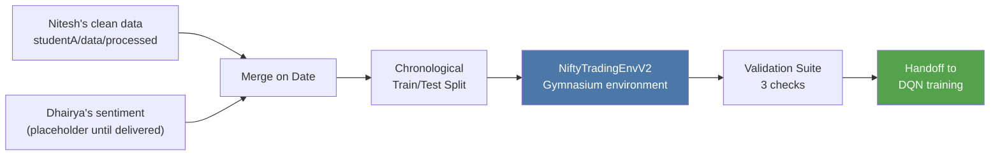
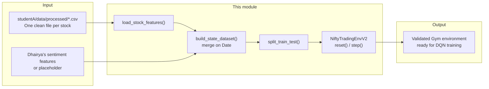

# NIFTY 50 Trading Environment — RL Environment Module (Sub-problem B)

> **Status:** Environment module, independently built and validated.
>
> This module handles data loading from the supervised baseline's clean
> output, sentiment integration, and Gymnasium-compliant environment
> construction for training an RL trading agent on NIFTY 50 data.
>
> **Owner:** Myadarapu Adithyasai · Sub-problem B

---

## 1. What This Module Does

Given Nitesh's clean, feature-engineered per-stock data and Dhairya's
sentiment scores, this module:

1. Loads and validates one stock's engineered feature set, explicitly
   rejecting known-corrupted or non-single-stock source files.
2. Merges price/technical features with sentiment features on Date.
3. Splits the merged dataset chronologically into train/test.
4. Wraps the result in a Gymnasium-compliant environment exposing a
   discrete Buy/Hold/Sell action space and a transaction-cost-aware
   reward function.
5. Validates the environment against three independent checks before
   handoff: Gymnasium API compliance, a random-action smoke test, and a
   buy-and-hold correctness check against a manual calculation.

This module is intentionally decoupled from any specific RL algorithm —
it defines the market simulation an agent trains inside, not the agent
itself.



---

## 2. Project Structure

```text
nifty-rl-env/
├── config_env.py                 # Single source of truth: paths, column rules
├── load_studentA_features.py     # Loads Nitesh's clean per-stock data
├── sentiment_loader.py           # Sentiment loader + placeholder generator
├── build_state_dataset.py        # Merges price + sentiment features
├── split_dataset.py              # Chronological train/test split
├── nifty_trading_env_v2.py       # The Gymnasium environment itself
├── test_env_v2.py                # 3-part validation suite
└── HANDOFF_NOTES.md              # Integration notes and open questions
```

`config_env.py` is the central configuration layer. Every other module
imports its column lists and paths rather than duplicating them.

---

## 3. Pipeline Architecture



The pipeline preserves chronological order throughout. The agent's
observation at step `t` is built only from data known as of `t - 1` —
never from `t` itself — and reward is the return earned between those
two points. This is verified, not just assumed: see Section 6.

---

## 4. Module Documentation

### 4.1 `config_env.py` — Single Source of Truth

| Constant | Purpose |
|---|---|
| `STUDENT_A_PROCESSED_DIR` | Path to Nitesh's clean processed data |
| `EXCLUDED_FILES` | Non-single-stock files rejected outright (`NIFTY50_all.csv`, `stock_metadata.csv`) |
| `RAW_NUMERIC_COLUMNS`, `ENGINEERED_COLUMNS` | Nitesh's feature groups |
| `SENTIMENT_COLUMNS` | Dhairya's feature group |
| `LEAKAGE_COLUMNS_NEVER_USE_AS_FEATURES` | `Tomorrow_Close`, `Tomorrow_Return`, `Target` — explicitly banned from the state |
| `FEATURE_COLUMNS` | The final, complete numeric feature list used in the observation |
| `DEFAULT_TICKER` | Which stock the environment currently trades |

Centralizing these values means a column change only needs to happen in
one place — the exact DRY discipline missing from earlier versions of
the codebase elsewhere in the project.

### 4.2 `load_studentA_features.py` — Clean Data Loader

| Function | Responsibility |
|---|---|
| `list_available_tickers()` | Lists valid single-stock files, excluding known-corrupted ones |
| `load_stock_features(ticker)` | Loads one stock's clean feature set, with schema and leakage checks |

Refuses to load `NIFTY50_all.csv` under any circumstances — it mixes
all 50 companies' rows together and would silently corrupt any rolling
calculation computed across it.

### 4.3 `sentiment_loader.py` — Sentiment Integration Point

| Function | Responsibility |
|---|---|
| `generate_placeholder_sentiment(dates)` | Temporary neutral (zero) sentiment, used until Dhairya's real pipeline is integrated |
| `load_real_sentiment_features(path)` | Loads Dhairya's real output once delivered, with schema validation |

Designed so that switching from placeholder to real sentiment data is a
one-line change in `build_state_dataset.py` — no other file needs to move.

### 4.4 `build_state_dataset.py` — Merge Step

Left-joins price/technical features with sentiment features on `Date`,
filling missing sentiment with 0. Runs a final safety check confirming
every expected feature column is present and no leakage column has
been introduced before returning the dataset.

### 4.5 `split_dataset.py` — Chronological Split

Splits by date, never randomly. Auto-detects a valid test window from
the data actually present rather than assuming a hardcoded date range —
this was added after discovering the source data does not reach the
project's originally planned 2023 test window (see Section 7).

### 4.6 `nifty_trading_env_v2.py` — The Environment

| Property | Value |
|---|---|
| Observation space | `Box`, shape `(len(FEATURE_COLUMNS) + 1,)` — one feature row plus position |
| Action space | `Discrete(3)` — Sell / Hold / Buy |
| Reward | Daily portfolio return while holding a position, minus transaction cost on position changes |
| Episode | One full pass through the given dataset |

**Lookahead-bias prevention:** the agent's action at step `t` is decided
using the feature row from `t - 1`; reward is the return from `t - 1`'s
close to `t`'s close. The agent never sees the price or features for
the day it is currently being scored on.

### 4.7 `test_env_v2.py` — Validation Suite

1. **Gymnasium API compliance** (`check_env`) — PASSED
2. **Random-action rollout** (300 steps, no crashes) — PASSED
3. **Buy-and-hold correctness check** — the environment's computed
   return is compared against an independent manual calculation from
   the raw price series. **PASSED** at a 0.019% difference (fully
   explained by transaction cost) after fixing an off-by-one error
   discovered during this exact check.

---

## 5. End-to-End Usage

```bash
python load_studentA_features.py   # sanity-check the data loads
python sentiment_loader.py         # sanity-check the placeholder
python build_state_dataset.py      # merge price + sentiment
python split_dataset.py            # check train/test split
python test_env_v2.py              # full validation suite
```

---

## 6. Design Principles

1. **No lookahead bias** — enforced structurally in `_get_observation()`
   and `step()`, not left as a documentation promise.
2. **Single source of truth for columns** — `config_env.py`, to avoid
   the multi-copy `EXCLUDE_COLUMNS` drift found elsewhere in this project.
3. **Verified, not assumed, correctness** — every claim above (API
   compliance, no crashes, correct reward math) was actually executed
   against real data, and one real bug was caught and fixed in the
   process (see Section 7).
4. **Explicit corruption defense** — known-bad source files are rejected
   by name, not just avoided by convention.

---

## 7. Known Limitations and Open Issues

* **Not yet integrated with the trained model.** An audit of the full
  team repository found that the DQN actually trained and deployed
  (`backend/model.py`, `dqn_nifty50_trading_agent_sentiment.ipynb`)
  uses a different, independently-built environment — a 30-day rolling
  window across 30 features (901-dim observation) with a
  `MultiStockTradingEnv` wrapper for multi-stock training. This
  module's single-row design (32-dim) was validated correctly but was
  not the one carried into training. **This needs to be resolved with
  the team before final submission** — either by reconciling the two
  designs or by clearly documenting which one is authoritative and why.
* **2023 test window is not reachable.** Nitesh's source data ends
  April 2021. `split_dataset.py` currently falls back to the last
  available year as a stand-in.
* **Single-stock only, as delivered.** The multi-stock question was
  intended to be a mentor-guided decision; it was independently
  resolved in the training notebook without this module's involvement.
* **Sentiment is still a placeholder in this module's own testing** —
  correct by design until Dhairya's pipeline output is confirmed stable,
  but any comparison of "with vs. without sentiment" run through this
  specific module is not yet meaningful.
* **Transaction cost (0.1%) and reward scaling are unvalidated
  assumptions**, not tuned or benchmarked against alternatives.

## Future Work

* Reconcile this environment with the one actually used in training, or
  formally document why two independent implementations exist.
* Replace the sentiment placeholder with Dhairya's verified real output.
* Resolve the 2023 test-window gap with the team.
* Extend to multi-stock support if that remains the team's direction.

---

## Summary

This module provides a structurally lookahead-safe, independently
validated Gymnasium environment for NIFTY 50 trading, built on top of
the supervised baseline's clean feature output. Its correctness has
been verified through execution, not assumption — including catching
and fixing a real bug during validation. Its main open risk is not
correctness but **integration**: confirming with the team which
environment implementation is the one actually moving forward.
