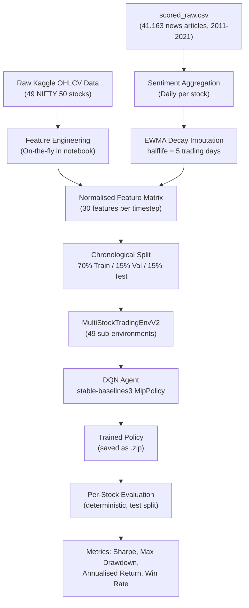
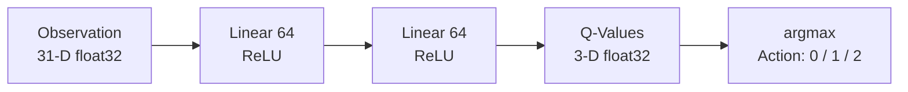
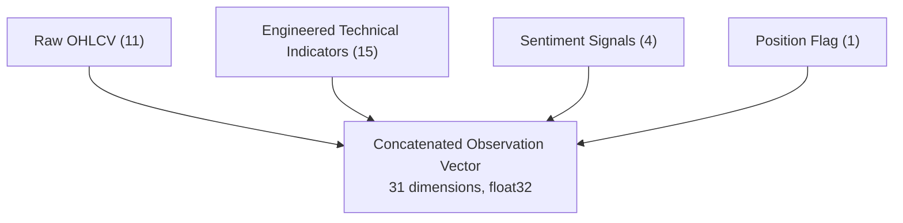
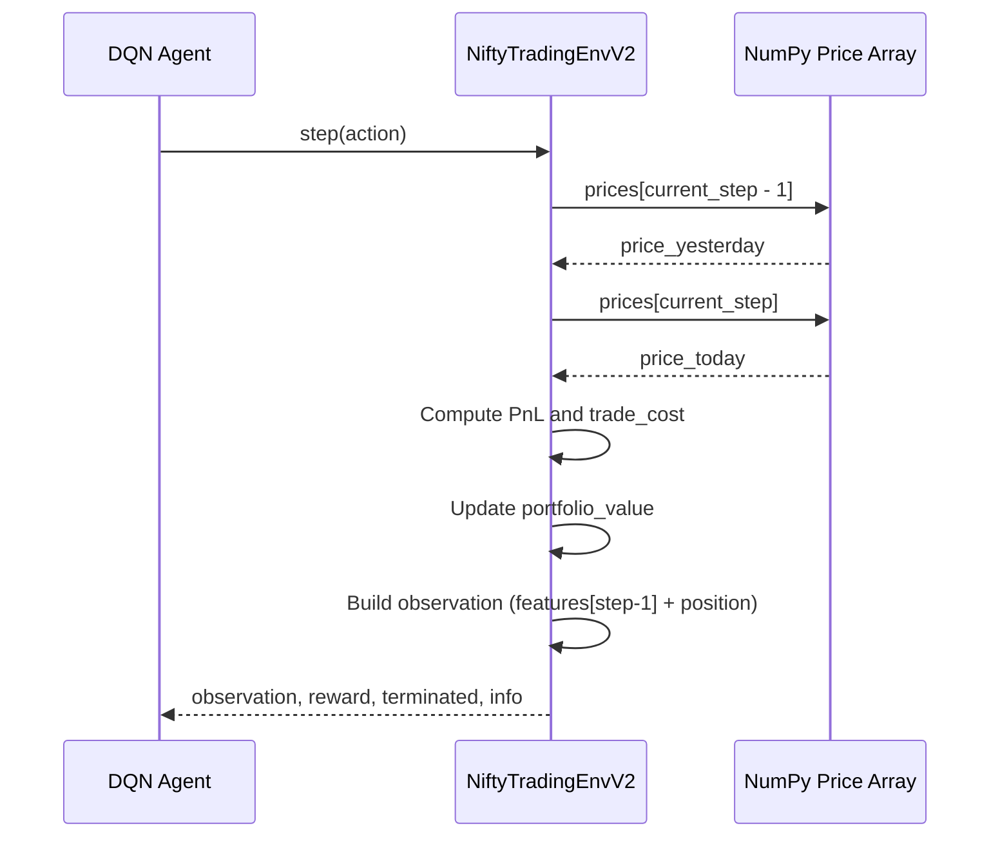
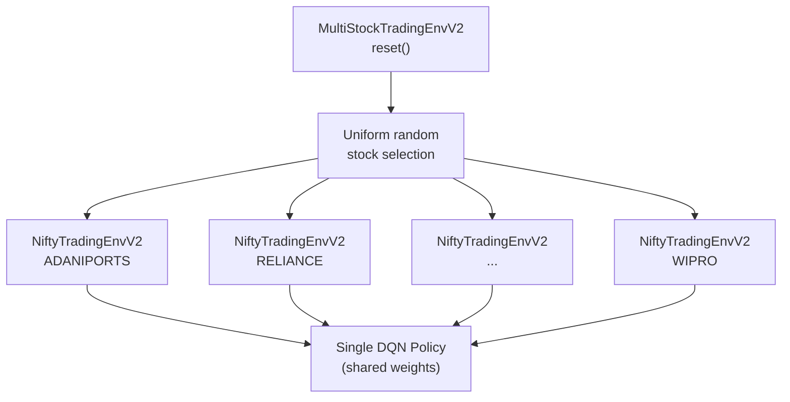
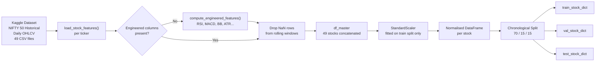
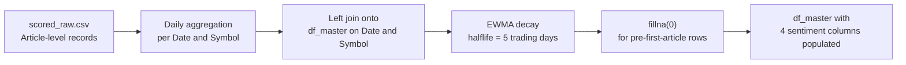
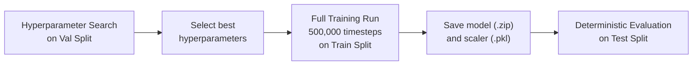

# DQN Agent in RL Based Algorithmic Trader

A Deep Q-Network (DQN) agent trained to make long/flat trading decisions across NIFTY 50 constituent stocks using a combination of raw price features, engineered technical indicators, and news sentiment signals.

---

## Table of Contents

1. [Overview](#overview)
2. [Architecture](#architecture)
3. [State Space](#state-space)
4. [Action Space](#action-space)
5. [Reward Function](#reward-function)
6. [Trading Environment](#trading-environment)
7. [Data Pipeline](#data-pipeline)
8. [Sentiment Integration](#sentiment-integration)
9. [Training Setup](#training-setup)
10. [Evaluation Metrics](#evaluation-metrics)
11. [Installation and Usage](#installation-and-usage)
12. [Repository Structure](#repository-structure)

---

## Overview

This project applies Deep Reinforcement Learning to the problem of single-asset equity trading on the NIFTY 50 universe. A single DQN policy is trained in a multi-stock environment, where each training episode randomly selects one of the 49 constituent stocks and runs a full episode on that stock's historical price series. At evaluation time, the policy is applied deterministically to an unseen chronological test split of each stock.

The agent receives a 31-dimensional observation at every timestep and outputs one of three discrete actions: Buy, Hold, or Sell. The design deliberately avoids lookahead bias: the observation used to decide action at time t is constructed from market data at time t-1.

---

## Architecture



The neural network policy is a multi-layer perceptron (MLP) with two hidden layers (the stable-baselines3 default: 64 units each, ReLU activations). The network maps the 31-dimensional observation vector to three Q-values, one for each action, and the agent selects the action with the highest Q-value.



---

## State Space

The observation at timestep t is a 31-dimensional float32 vector constructed as:

```
observation = [ feature_row(t-1), position_flag ]
```

The feature row at t-1 is used (not t) to prevent the agent from seeing the current day's closing price before deciding whether to buy or sell. The position flag appended at the end indicates whether the agent currently holds a long position (1) or is flat (0).

### Feature Groups

| Group | Count | Features |
|---|---|---|
| Raw OHLCV | 11 | Prev Close, Open, High, Low, Last, Close, VWAP, Volume, Turnover, Trades, Deliverable Volume |
| Engineered Technical | 15 | Log_Return, Vol_10D, Vol_20D, Dist_SMA_10, Dist_SMA_20, Dist_SMA_50, RSI_14, MACD, MACD_Signal, MACD_Diff, BB_Pband, ATR_14, Volume_Ratio_20, VWAP_Dist, Deliverable_Pct |
| Sentiment | 4 | Sentiment_Score, Sentiment_Magnitude, Article_Count, Sentiment_Rolling_3D |
| Position flag | 1 | Current position (0 = flat, 1 = long) |
| **Total** | **31** | |

All 30 feature columns are standardised with a StandardScaler fitted exclusively on the training split before being fed to the agent.



### Engineered Technical Indicators

| Feature | Description |
|---|---|
| Log_Return | log(Close_t / Close_{t-1}) |
| Vol_10D | 10-day rolling standard deviation of Log_Return |
| Vol_20D | 20-day rolling standard deviation of Log_Return |
| Dist_SMA_10 | (Close - SMA_10) / SMA_10 |
| Dist_SMA_20 | (Close - SMA_20) / SMA_20 |
| Dist_SMA_50 | (Close - SMA_50) / SMA_50 |
| RSI_14 | Relative Strength Index, 14-day window |
| MACD | EMA_12 - EMA_26 of Close |
| MACD_Signal | 9-day EMA of MACD |
| MACD_Diff | MACD - MACD_Signal |
| BB_Pband | Bollinger Band %B, 20-day window, 2 standard deviations |
| ATR_14 | Average True Range, 14-day window |
| Volume_Ratio_20 | Volume / 20-day SMA of Volume |
| VWAP_Dist | (Close - VWAP) / VWAP |
| Deliverable_Pct | Deliverable Volume / Total Volume |

---

## Action Space

The action space is discrete with three possible actions:

| Action | Integer | Meaning |
|---|---|---|
| Sell | 0 | Close long position (no-op if already flat) |
| Hold | 1 | Maintain current position unchanged |
| Buy | 2 | Open long position (no-op if already long) |

The agent can only hold a position of 0 (flat) or 1 (fully long). Short selling is not supported. This represents a long-only trading strategy consistent with typical retail constraints in Indian equity markets.

---

## Reward Function

The reward at each timestep is defined as:

```
reward = (pnl - trade_cost) / initial_capital
```

Where:

- `pnl = portfolio_value * daily_return` if position is long, else `0.0`
- `daily_return = (price_today - price_yesterday) / price_yesterday`
- `trade_cost = transaction_cost * portfolio_value` (charged only when the position changes)
- `transaction_cost = 0.001` (10 basis points, 0.1% per trade)
- `initial_capital = 1,000,000 INR`

Normalising by initial capital keeps the reward signal scale-invariant across stocks with very different price levels.

---

## Trading Environment

The environment is implemented as two Gymnasium-compatible classes.

### NiftyTradingEnvV2

Trades a single stock over its full historical price series.



Key design decisions:

- **Lookahead-free observation:** The agent sees features from t-1 when deciding the action executed at t.
- **NumPy array backing:** All price and feature lookups during `step()` use pre-computed float32 NumPy arrays rather than Pandas DataFrame row access, reducing per-step overhead by approximately 50x.
- **Episode termination:** An episode ends when `current_step >= len(df) - 1`.

### MultiStockTradingEnvV2

Wraps 49 `NiftyTradingEnvV2` instances. On each `reset()` call, a stock is sampled uniformly at random. This allows a single DQN policy to generalise across the full NIFTY 50 universe without training separate agents per stock.



---

## Data Pipeline



The raw data source is the [NIFTY 50 Stock Market Data (2000-2021)](https://www.kaggle.com/datasets/rohanrao/nifty50-stock-market-data) dataset from Kaggle. Each CSV contains daily OHLCV fields plus VWAP, Turnover, Trades, Deliverable Volume, and Deliverable percentage.

Feature engineering is performed on-the-fly within the notebook, requiring no pre-processed files. The scaler is fitted exclusively on the training portion of each stock's data and persisted to disk alongside the trained model.

---

## Sentiment Integration

News sentiment data is sourced from `scored_raw.csv`, which contains 41,163 article-level records spanning April 2011 to April 2021 across 45 NIFTY 50 tickers. Each record contains a sentiment score and magnitude computed at the article level.

### Aggregation to Daily Frequency

Multiple articles on the same date and stock are collapsed into a single daily row:

| Sentiment Column | Aggregation |
|---|---|
| Sentiment_Score | Mean of per-article scores |
| Sentiment_Magnitude | Mean of per-article magnitudes |
| Article_Count | Count of articles |
| Sentiment_Rolling_3D | 3-day rolling mean of Sentiment_Score |

### Imputation for No-News Days

Approximately 70-80% of trading days have no corresponding news article. A naive zero-fill creates an artificial signal that the agent cannot distinguish from a genuinely neutral market. Instead, an Exponential Weighted Moving Average (EWMA) decay is applied:

```python
x.ewm(halflife=5, min_periods=0).mean().fillna(0)
```

With a half-life of 5 trading days, sentiment decays as follows after a news event:

| Days since last article | Signal retained |
|---|---|
| 0 | 100% |
| 5 | 50% |
| 10 | 25% |
| 25 | ~3% |



---

## Training Setup

| Parameter | Value |
|---|---|
| Algorithm | DQN (Deep Q-Network) |
| Policy | MlpPolicy (2 hidden layers, 64 units each, ReLU) |
| Observation dimension | 31 |
| Action space | Discrete(3) |
| Training timesteps | 500,000 |
| Replay buffer size | 100,000 |
| Batch size | Tuned (from hyperparameter search on val split) |
| Learning rate | Tuned (from hyperparameter search on val split) |
| Discount factor (gamma) | Tuned (from hyperparameter search on val split) |
| Exploration fraction | Tuned (from hyperparameter search on val split) |
| Final epsilon | 0.05 |
| Target network update interval | Every 1,000 steps |
| Network update frequency | Every 4 environment steps |
| Gradient steps per update | 1 |
| Initial portfolio value | 1,000,000 INR |
| Transaction cost | 0.1% per trade (10 basis points) |
| Random seed | 42 |
| Data split | 70% Train / 15% Val / 15% Test (chronological) |

Hyperparameters (learning rate, gamma, batch size, exploration fraction) are selected via a grid search conducted on the validation split before the final training run.

### Training Timeline



---

## Evaluation Metrics

The trained policy is evaluated deterministically (epsilon = 0) on the held-out test split of each stock independently. The following metrics are computed per stock and then aggregated:

| Metric | Formula |
|---|---|
| Sharpe Ratio | mean(daily_returns) / std(daily_returns) * sqrt(252) |
| Max Drawdown | max over equity curve of (peak - trough) / peak |
| Annualised Return | (final_value / initial_value)^(252/n_days) - 1 |
| Total Return % | (final_value / initial_value - 1) * 100 |
| Win Rate % | fraction of steps where reward > 0 |

Each metric is compared against a Buy-and-Hold baseline, which holds the stock for the entire test period with a single entry transaction cost.

---

## Installation and Usage

### Requirements

```
python >= 3.10
stable-baselines3
gymnasium
shimmy
torch
pandas
numpy
scikit-learn
matplotlib
seaborn
joblib
```

### Running on Kaggle (Recommended)

1. Upload `dqn_nifty50_trading_agent_sentiment.ipynb` to Kaggle.
2. Add the [NIFTY 50 Stock Market Data](https://www.kaggle.com/datasets/rohanrao/nifty50-stock-market-data) dataset as a Kaggle dataset input.
3. Upload `scored_raw.csv` as a separate Kaggle dataset input.
4. Open **Section 1.1** of the notebook and update the two path constants:

```python
PROCESSED_DATA_PATH = '/kaggle/input/<your-nifty-dataset-name>/'
SENTIMENT_CSV_PATH  = '/kaggle/input/<your-sentiment-dataset-name>/scored_raw.csv'
```

5. Enable GPU (T4 recommended) from accelerator settings.
6. Run all cells from top to bottom. Expected runtime: 10 to 15 minutes.

### Inference

After training, a single-step inference call can be made using the provided wrapper in Section 15:

```python
from joblib import load as joblib_load

scaler = joblib_load('dqn_nifty50_v2_scaler.pkl')

# feature_row is a (1, 30) DataFrame with exactly FEATURE_COLUMNS
action = predict_action_v2(
    feature_row_df=feature_row,
    current_position=0,      # 0 = flat, 1 = long
    scaler=scaler,
    model_path='dqn_nifty50_v2_agent'
)
# Returns one of: 'Buy', 'Hold', 'Sell'
```

---

## Repository Structure

```
RL_Based_Algorithmic_Trader/
|
|-- dqn_nifty50_trading_agent_sentiment.ipynb   # Main notebook (self-contained)
|-- scored_raw.csv                               # Article-level news sentiment data
|-- README.md                                    # This file
|
|-- backend/
|   |-- features.py                             # Technical indicator implementations
|
|-- nifty-rl-env/
    |-- config_env.py                           # Feature column definitions
    |-- load_studentA_features.py               # Data loading utilities
    |-- nifty_trading_env_v2.py                 # Environment class (reference)
    |-- test_env_v2.py                          # Environment unit tests
```

---

## Key Design Decisions

**Single-row state instead of rolling window:** An earlier version of this codebase used a 30-day rolling window of raw OHLCV values as the state, producing a 450-dimensional input. The current design uses a single feature row where each engineered indicator (RSI, MACD, volatility, Bollinger Bands) already encodes its own rolling history internally. This reduces the observation dimension to 31, makes training significantly more sample-efficient, and eliminates the need for a convolutional or recurrent architecture.

**Multi-stock shared policy:** Training a single policy across all 49 stocks rather than 49 separate policies forces the agent to learn market-regime patterns that generalise across companies and sectors. It also avoids overfitting to the idiosyncratic noise of any single stock's price history.

**No lookahead bias:** The observation at time t is constructed from the feature row at t-1. The agent commits to an action before seeing the closing price at which that action will be executed, which correctly mirrors the causal constraints of a live trading system.

**EWMA sentiment decay:** Rather than a hard forward-fill cutoff that creates abrupt transitions to zero, an exponential decay allows the agent to maintain a smooth, physically meaningful belief about recent sentiment, degrading gracefully as trading days pass since the last news article.
